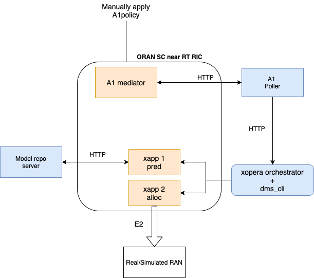

# demo-2021
Integrated code of ITU Buildathon 2021 activities. This was a problem statement of [ITU AI/ML Challenge 2021](https://aiforgood.itu.int/about/aiml-in-5g-challenge/) sponsered by ITU FG on Autonomous networks

This repo consists code submitted by following teams

Team Automato: https://github.com/krcmehmet/ITUChallenge_BuildaThon_Activity4 

Team RAN-RIC-xApp: https://github.com/deenammd/ITUML5GChallenge_BuildaThon 

Team WINEST: https://github.com/gblessed/Intent-Driven-Closed-Loops- 

Team-Conquerors: https://github.com/AdityaVMVS/Team-Conquerors

Integration done with help of Highstreet Technologies GmbH

# Installation
Follow *oran-README.md* to setup oran-sc near-rt-ric.

Then follow *integration-README.md* to setup intent based xapp orchestration.

# Overview

## Code structure

*a1poller* polls A1 mediator for new A1 policy

*cl-orch* contains YAML templates to orchestrate xapps based on the A1 policy

*lower-loop* contains code for xapps and model repo
